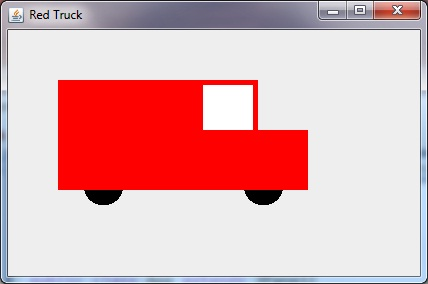
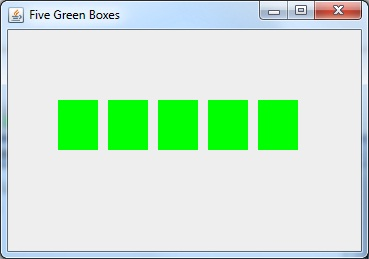

## Java 8-4 Swing [&LT;](Java0803.md) [&GT;](Java0805.md)
# Red Truck

Yer mission, Mr Brigs, should you choose to accept it, is to reproduce this image in yer java app. Should any members of your team be caught or killed the secretary will disavow any knowledge of your code.



## Spoiler for Red Truck

```java
  public static String title = "Red Truck";
  public void paintComponent(Graphics g){
    int x = 50; int y = 50; // upper left corner of truck
    int h = 60; int w = 250; // height and width of truck bed
    int ch = 50; // cab height
    int hw = 50; // hood width
    int ww = 50; // window width
    int wb = 5; // thin size of window border
    int ts = 40; // tire size
    int ti = 25; // tire inset from front and back
    int ty = y + h + ch -ts/2 -5; // tire axel slightly up from truck bottom
    
    g.setColor(Color.BLACK); // draw tires
    g.fillOval(x + ti, ty, ts, ts);
    g.fillOval(x + w - ts - ti, ty, ts, ts);
    
    g.setColor(Color.RED); // draw truck body
    g.fillRect(x, y + ch, w, h); // truck bed
    g.fillRect(x, y, w - hw , ch); // truck top
    
    g.setColor(Color.WHITE); // draw window
    g.fillRect(x + w - hw - ww - wb, y + wb, ww, ch - wb); 
  }
  ```

## Five Green Boxes

Try to produce this picture



## Spoiler for Green Boxes

```java
  public static String title = "Five Green Boxes";
  public void paintComponent(Graphics g){
    g.setColor(Color.GREEN);
    int xoff = 50;
    int yoff =70;
    int gap =50;   
    int n = 5;
    for(int i = 0; i<n; i++){
      g.fillRect(xoff + i*gap, yoff, gap - 10, gap);
    }
  }
  
```java
  
[next: Thread Art](Java0805.md)