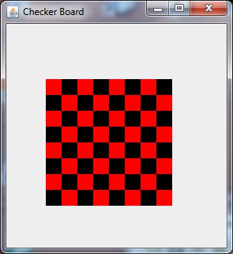

## Java 8-6 Swing [&LT;](Java0805.md) [&GT;](Java0807.md)
# Checker Board



This one involves two nested for loops, one managing rows and one managing columns. My sample code uses a bit of tricky math because I know that the sum of the row number and the column number is constant along a diagonal. 

(0,0) -> 0+0 = 0 - even number red<br/>(0,1) and (1,0) -> 1 - odd number black<br/>(0,2), (1,1),(2,0) all sum to 2 - even number red<br/>(0,3),(1,2),(2,1),(3,0) all sum to 3 - odd number black

So the way that you test if a number like n is even is that you look to see if the remainder when you divide by 2 is equal to zero.

You do remember the remainder function, %, don't you?

  n%2 == 0

tells you if the remainder of n divided by 2 equals zero

Give it a try

## Spoiler for Checker Board

```java
  public static String title = "Checker Board";
  public void paintComponent(Graphics g){
    int xoff = 50;
    int yoff =70;
    int cs = 20; // cell size  
    int n = 8;
    for(int x = 0; x<n; x++){
      for(int y = 0; y<n; y++){
        if((x + y)%2 == 0){ // this is tricky
                            // x+y is constant along a diagonal
                            // even diagonals are red and odd are black
                            // so we test the sum for evenness
          g.setColor(Color.RED);
        } else {
          g.setColor(Color.BLACK);
        }
        g.fillRect(xoff + x*cs, yoff + y*cs, cs, cs);
      }
    }
  }
  ```

[next: Brick Pyramid](Java0807.md)