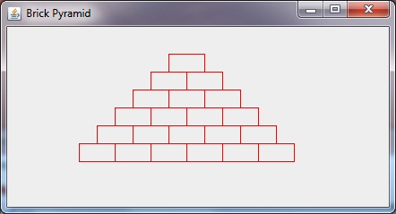

## Java 8-7 Swing [&LT;](Java0806.md) [&GT;](Java0808.md)
# Brick Pyramid



Observe that each row starts half a brick back from where the row on top of it started. Also observe that in row zero (You did notice that we had a row zero, didn't you) we have zero bricks, row 1 has 1 brick, and row N has N bricks. So the number of bricks that you want to draw in each row has a different limit for each different row.

## Spoiler for Brick Pyramid

```java
  public static String title = "Brick Pyramid";
  public void paintComponent(Graphics g){
    int xRowStart = 200; // this is where we start at the top
    int x; // this is initialized inside the loop
    int y = 10;
    int w = 40; // brick width    
    int h = 20;
    int numberOfRows = 7;
    g.setColor(Color.RED);
    for(int row = 0; row<numberOfRows; row++){
      x = xRowStart; // x starts here
      xRowStart = xRowStart - w/2; // next row will start half a brick back
      for(int i = 0; i<row; i++){ // draw the row
        g.drawRect(x, y, w, h);
        x = x + w; // x changes for next brick in this row
      }
      // after we have drawn the entire row, we increase y for next row
      y = y + h;
    }
  }
  ```

[next: Swing Input](Java0808.md)