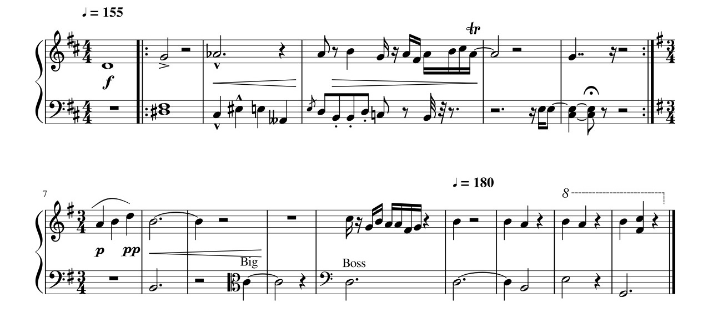

## MidJava 6-1 Music [&LT;](MJ0509.md) [&GT;](MJ0602.md)

# Overview

We will be implementing a subset of what one would typically do in a software system for editing what is known as Common Practice Music Notation. It will be a subset becasue music notation is sufficiently complex that we can not possibly do it all in a one semester course. 

One of the things that we will NOT be doing is saving files and printing our notation to paper, which are probably THE two most important things that one would do in a REAL software project. The reason for that omission is simple, we will focus on using the gesture system to see how gesture recognition can affect the user interface for the entry and editing of music. Typing in a file name and saving a file has NO interesting user interface consequences so we won't spend time doing that obvious work. Similarly we won't bother with creating multi-page compositions, a requirement for any real application but unnecessary in a demo app like this one.

On the other hand what we will do is try to build a system that allows us to quickly produce a page of music that will look like real music and which will give the impression that you have created an entire music notation application and are almost finished.

In a sense this will be a bottom up approach. We will build a component that will draw something on the screen. Then we augment it so that we can provide a new feature and so on. MAXIMUM visibility as opposed to optimal design structure. There is a reason for this approach. We are NOT building a application. Instead we are doing research on User Interface design. We are exploring whether gesture recognition is a GOOD alternative to more traditional, Pick-n-Place, GUI paradigms.

So here in the overview section I will mostly be giving you NAMES of components that would show up in a typical music notation app (which of course will often become class names for us) and also give very rough sketch of what sorts of information the class will hold. Most of my students in the past do NOT know anything about music notation when they get started. Here is a partial vocabulary list of some of the elements that we will be building - we may get to all of these, we may not:

## Alpahbetical Vocubulary
Accents, Accidental, Augmentation Dot, Barline, Beam, Clef, Creshendos, Decreshendos, Dynamics, Fermata, Fine(Fee-nay) Bar, Flag, Head, Key Signature, Ledger Line, Octave Shift, Repeats, Rest, Seconds, Slur, Staccoto Dots, Staff, Stem, System(Sys), Tablature (Tab), Tempo Marks, Tie, Time Signature, Trills, Voice

## Music Notation example

## Definitions and comments

## Staff, System, Barlines
The group of 5 lines on which the notes are written are called **staffs**. There are typically 5 stafflines in a staff thought there are varients usually when writing tablature for specific instruments. So for example Guitars have 6 strings, so guitar tabulature has 6 lines, Banjo Tab has 4, Percussion Staffs are sometimes done with 1.

Typically one staff represents the note for one instrument or **voice**, though some instruments like piano and organ allow you to play so many notes all at the same time that they treat them like 2 or 3 voices and use 2 or three staffs to represent the music. Basically piano music has a staff for the right hand and a second staff for the left hand. Organ will have a third staff for the pedals that are operated by the feet.

The staffs of music are there to reprened the **pitch** of the notes, the higher the note is written on the staff, the higher the pitch of the note. If two notes are vertically stacked, it means that they are sounded at the same time, otherwise, one note follows another on the page in reading order from left to right and that represents the order in which the notes are sounded.

The staffs (one for each voice) are typically grouped vertically into a **system**. Unfortunately this musical term collides with the standard Java class that you see all the time in System.out.println(), so we will not use that correct musical word, instead we will shorten it to **Sys**. A single piece of music will typically span several pages, each page will consiste of as many Systems as will comfortably fit on a page and each System contains as many staffs as it needs to match the instrumentation of the piece, so a String quartet's Sys will have 4 staffs, a flute sonata will have 1 staff for the flute and 2 for the piano accompaniement.

So the Systems and the Staffs are essentially the coordinate systems that contain the music.

As the musical notes move forward in time they are typically grouped into Rhythmic blocks called **measures**. The vertical lines that separate the measure are called **measure lines** or **barlines**. So the measure itself consistes of the notes that land between two successive barlines. Those barline come in several different visual formats or flavors. 

The most common is just a stright line going though the staffs (and depending on the instrumentation the line may cross ONLY the staff lines, or it may cross the SPACE between two different staffs). 

If you look at the end of a pice of music you will see a **Fine Barline** (That's Italian for END and is pronounced: 'Fee-nay' it is not the English word 'fine'. Many of the words in music come from Italian.) A Fine BarLine consists of a thin line next to a fat line. 

If you scan through the music in the photo above you will also see some **Repeat Barlines** which also consist of both a thin line and a fat line, but you will see that they also have dots associated with them. These repeat barlines act like parentheses in a piece of music marking the beginning and the end of a section of music that is supposed to be played twice before moving on in the music.

At the start of each system on the page, there are typically 3 things drawn onto each staff to remind the musician of the status of the music notation. Those three things are:

## 1. Clef

The **Clef** - which primarily show how highly pitched the notes are in that staff. Clef signs usually occur in 3 varients, a **Treble clef** (aka G clef) for highly pitched instruments, like piano right hand, flute, and violin. The low pitched clef is called a **Bass clef** (or F clef) used for piano left hand, or bassoon, or Bass violin, or Tuba. There is a third clef (rarely used anymore outside of symphonic scores) called the **C clef** that is roughly between the Treble and the Bass clef. 

While you MUST have a clef sign at the start of each staff, you MAY have one anywhere in the middle of the music to change the type of staff that it is. For example if the staff was mostly high pitched noted but the music has moved way down into the low register, you may change the staff to be a bass staff by dropping in a bass clef somewhere in the middle of the staff. The Clef at the front of the staff is to remind you which clef is currently in effect for that staff.
 
## 2. Key Signature

The pile of 2 Sharp signs right after the Clef is the **Key Signature**. It tells you that the notes that occure on those marked staff lines will all be pitched a little bit higher than they normally would have been had they not been altered.

Those Sharp signs are a particular instance of a more general thing called an **Accidentals** and they occur in 5 different visual varieties named: **Flats**, **Sharps**, **Naturals**, **Double_Flats**, and **Double_Sharps**. 

Much like clefs, you can have accidentals, where you **raise** or **lower** a note but just a little bit at any time, so you will see other accidentals throughout the piece occuring just in front of a note that they affect. Unlike clefs that change the nature of the staff until you mark some further change, an accidental is a temporary effect only affecting the notes in a single measure before the staff line lapses back to its default value which is what the Key Signature indicated.

## 3. Time Signature

The **time signature** indicates how many and what types of beats make up a single measure. In our sample piece that time signature was 4/4, this meant that there were 4 quarter notes per measure. A tempo of 3/4 means that there are 3 quarter notes per measure. You will see in the sample piece that at the end of the first system, the time signature changed to 3/4 and that change was reflected in the time signature at the start of the second system.

The fact is, in our sample piece of music we changed both the key signature and the time signature at the end of the first system, and both of those changes are reflected in the new signatures in the second system. These changes of either of the signatures are allowed at any measure bar BUT, you are NOT allowed to change them at the start of a new system. IF the actual changes take place at the very first measure in a new system, then you must actually indicate that you INTEND to change them as we did here at the end of the previous system. So it is fine to change them in the middle of a system, and then the next system starts with a reminder of what they had been changed to in the middle of the previous system.

Most time signatures consiste of one number written over another number but there is also a special symbol that looks like a C that means **Common** time which is an abbrievation for the very common time signature of 4/4.

## Heads, Stems, Rests, Flags, Beams, Augmentation Dots

The actual notes to be played are represented basically by ovals. Those ovals are typically either filled in or not, and they usually come in 3 forms, 

1) a **quarter note** has a **head** which is solid black filled oval and the head has a **stem** which is a vertical bar either immediately to the right of the head going up, or immediately to the left going down. 

2) a **half note** head is just the outline of an oval (so the note looks white) and it also has a Stem, 

3) a **whole note** head is also just the outline of an ellipse BUT it has no stem.

Those designations of the notes as, whole, half, quarter are intended to suggest fraction and represent the subdivisions of time in music. If we are in common time, 4/4, four quarter note to a full measure, a whole note fills a whole measure taking all 4 counts or beats. A half note is two counts, or half of the measure, a quarter note is one count or one quarter of the measure. 

We continue that ability to subdivide time and play even faster notes, **eighth notes**, **sixteenth notes**, **thirty second notes**, etc. However we indicate those further time subdivisions in music NOT by changes to the note heads as we did with the whole, half and quarter heads, instead we indicate further subdivisions of time by adding **flags** to the stem. A stem with no flags is a quarter, a stem with 1 flag is an eights, a stem with 2 falgs is a sixteenth, a stem with 3 flags is a thirty second, and so on. 

We have a thirty second note with 3 flags in the sample piece in the second half of the 4th measure down in the bass clef of the piano part.

The shape immediately after that thirty-second note is a thirty-second **rest**. It looks a bit like the number 7 except that it has 3 horizontal lines running into the slash. If you look throughout the piece you will see thing that look like a 7 with one horizontal component - that would be an eight rest and you will see ones with 2 horizontal components, which would be a sixteenth rest. 

Rests, just like notes occupy time. Unlike notes, rests have no pitch. They are the absense of music rather than the presence of music. They are the 'breaks' in the flow of sound. That rests that match the whole, half, and quarter notes each have special symbols that do NOT look like the number '7'.

In our sample piece of music the piano part starts with a whole note in the treble part (the right hand) and the left hand gets a whole rest to match it. That whole rest is the filled in black rectangle that is hanging below one of the staff lines (and is vertically alligned with the whole note). In the next measure, the treble part consists of a half note followed by a half rest. You can see that the half rest is still a filled rectangle but now it is drawn on top of a staff line instead of hanging underneath one. (The story that music teachers tell children when they are learning to read music - 'The whole rest is so STRONG it can HANG from a staff line, but that WEAK little half rest is so tired it has to REST on top of the line.' I will no doubt still be telling this to people when I am confined to a nursing home when dementia has consumed everything else in my mind :)

The third measure into the piece in the right hand piano part has a 'dotted half note' followed by a 'quarter rest'. Doted notes are note heads followed immediately by an **Augmentation Dot**. The purpose of the dot is to extend the time by half of its natural time, so since a half note typically takes 2 counts, half of that is 1 count, so the dotted half is 3 counts total. Since the quarter rest is one count, this makes the measure sum up to 4 counts total just as we expected from the 4/4 time. You can have more than one dot on a note (see for example the 6th measure, it has a double dotted quarter note) and since dots affect time and since rests also represent time you can in fact dot rests in the same way that you can dot notes (there is a dotted half rest in the bass part measure 5).

The flags that change the duration of a note are drawn in a curved shape if they are on a single stem, however they can be added to several adjacent stems all at once in which case they are drawn completely straight. We reserve the word 'flag' for isolated flags, and use the words **beam** or **beamed group** to refer to the variety that are shared by multiple stems. 

In our example the first beamed group that shows up is in the bass hand in the 4th measure. There are 4 notes beamed together. Because there is one single beam (same as one flag) each of those 4 notes is an eighth note. There is no sound difference what so ever implied by using beams instead of flags. The reason for the beams is simpley to be faster to draw, to take less space, AND to help the eye spot regular patterns. For example, it is very rare to beam across the halfway point of a measure. (see measure 11 which has two beamed sixteenth notes followed by 4 beamed sixteenth notes. They were NOT all beamed together because that would have spanned the mid point. This makes it easier in reading music to see that mid point.) 

Generally the beams in a single beamed group span across all the stems in the group but that is not required. If you look at measure 5 you will see a beamed group of 2 notes, where one beam, (the "master beam", the one that is furthest from the note heads) touches all stems (as it MUST) but the one on the "inside" which is closer to the heads touches only one of the stems, the first stem. This means that the first stem has 2 flags on it but the second stem has only one flag on it. The is no official name for one of those beams that does not reach all the way from one stem to another but in MY music notation software it was always refered to as a **beamlet**

## Acents, Trills, Dynamics, Creshendos, Decreshendos

There are many other marks on a piece of music that have less to do with the notes, their pitches and their timing. Those other aspects are things like **Tempo markings** to indicate how fast or slow some passage should be played, **Dynamic markings** to indicate how loud or how quietly a passage should be played. If the volume is supposed to start quite and gradually increase to loud (called **Creshendo**) it is marked with a long extended open angle bracket that starts at a point and has the two branches getting wider apart. The alternative, a **Decreshendo** where the music diminishes in volume, is marked with a closing angle bracket, starting wide apart and narrowing down to a single point. 

The Dynamic marking are generally single letters like "p", short for "piano" meaning "quiet" and "f" for "forte" meaning "loud" and they come in small groups like "ppp" for "really really quiet" or "fff" for "really really loud". Accents and trills may be marked with symbols like "V" or "&gt;" or letters like "tr" which is short for "trill"

## Slurs, Staccoto, and Ties
A **slur** is a group of notes that are supposed to be smootly connected together, the end of one note running right into the beginning of the next note. In our example there is a slur over 3 notes in the right hand of the piano in measure 7. Slurs are drawn with a curved line that starts at a point, gets wider in the middle, then shrinks back to a point.

Mostly all music is supposed to connect one note to the next so for the most part there is no need to mark slurs, they are typically used only in some music for emphasis. However the opposite, where the notes should be somewhat disconnected, is called **Staccoto** and is typically marked with a dot either above or below the note head (depending on which way the stems run). Measure 4 in the bass line has 3 staccoto eighth notes in a beamed group.

 **Ties** are VERY different from Slurs. They are NOT different graphically. They are drawn with the same slighly curved stroke, starting and ending at points but swelling in the middle. A tie goes exactly between two consecutive note that are on the same staff line. 
 
 The meaning of the tie is that you ADD the duration of the two notes together and play them as if they were a single note with that summed duration. One of the uses of ties, which you can see in measure 12, is where you want to tie a note from one measure into the next. Since the notes in a single measure are not supposed to sum to a duration greater than what the time signature tells you belongs in a measure, if you want to have a longer duration note you need to use ties to add them. In our example there are at least 5 ties.

## Layout rules

In addition to the many symbols and their special meanings there are also many layout rules that must be followed when writing music. I will not even attempt to list them all here there are too many and there is little need to list them. We will develop them as necessary, however it is useful to mention a few of them here because some of the design of our classes will be based on the layout rules.

For example: Augmentation dots are something that can be added to note heads (and to rests). While we COULD create a class DOT that refers to the head or the rest that it modifies, we won't. it is much easier to simply have an integer field in a head object that is the nDots, the number of dots that modify a given head and make it the job of the head to actually draw the dots that modify that head. And even that design is too complicated - The fact is, it is very common to have several note heads all joined up onto a single stem and by convention, all the notes that share a stem all must have the same duration, and since dots are part of that duration calculation they must all have the same number of dots. Furthermore, the way that you layout those dots, they must land in spaces NOT on staff lines so you need to look at the entire cluster of heads that share a stem to figure out where to actually draw the dots. As a result, we put a single integer field, nDots, into the Stem class to track whether or on all the notes on a stem need to be dotted and if so, how many dots.

As another example. Notes (and rests) that sound at exactly the same time are supposed to be vertically aligned. As a direct consequence of that, notes that are NOT sounding at the same time should NOT be written on the page in any way that makes it look like they MIGHT be vertically aligned. 

The musician needs to see that this note way down here in the lowest staff is NOT overlapping in any way with the location of that note way up there in the top staff of a single system. In essence, simultaneous times essentially leads to identical x values and non-simultaneous times need to be a x values that are sufficiently removed from one another that they would not be confused as being the same. 

So we will ultimately build a Time class, which essentially holds an X value. And notes that start at the same time should share that Time object. When we start drawing gestures on the page, the user will have a gesture that adds a head to the staff at the place that they drew the gesture. That Head insertion step however need to look at the x value where they drew the gesture and make a decision - was this x close to an existing Time object? If it was, we should make this new head share that time and snap to that existing x value otherwise we should create a new Time value and make the head refer to that time value.

So that will be our next step, to create some classes and fields in those classes that we believe will hold the elements that we need to represent our music notation.

[next: Music.java](MJ0602.md)