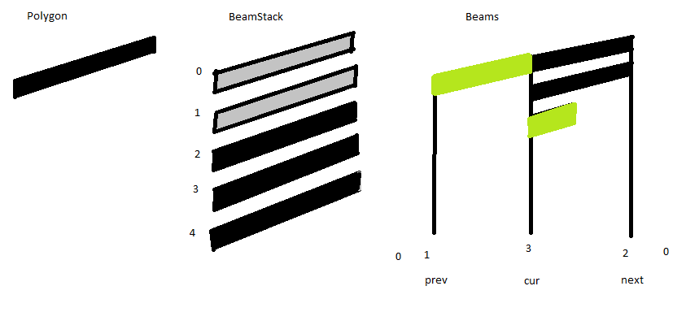

## MidJava 7-10 Music Notes [&LT;](MJ0709.md) [&GT;](MJ0711.md)

# Beams

Beams are used to both indicate the number of flags that are on a stem as well as grouping several stems together which is visually a way of consolidating sub-divisions of time back into whole blocks to make the counting for the musician easier.

The way that they are traditionally drawn with ink on paper very much guides and informs the way that we will produce them in our application. 

A beamed group of four 16th notes adds up to a quarter, which is typically a single beat in a four four measure, (four four means four sets of quarter notes). The way that you would draw that is this. First you draw the 4 notes on their appropriate pitches one after the other, all without stems. Then you draw the stems on the first note and on the last note of the beamed group. You pretty much follow the conventional stem length rules, making them an octave long but leaving extra space if there are lots of flags on the group. 

Now that you know the two y values for the beamEnds of those two stems, you can draw the first beam, the master beam, from the first note to the last note. Once that beam in place, you now have a target, the master beam, for the beam ends of the inner stems, so draw in those stems ignoring all the stem length rules. Finally you draw in any of the other beams that make up this group.

We will build our reactions to follow that same plan. We already have in place many of the reactions. We can draw the heads. We can put stems on the first and the last notes. And now we need something new.

We need a reaction that crosses two stems. We will want to use an E-E reaction because drawing a beem between two stems really is the same as adding flags to both stems.

However, a simple E-E stroke like this would confilct with the E-E that we already have to add a flag to a single stem. How do you distinguish between beaming two stems and just flagging a single stem.

The answer has got to be context. We will need a routine that notices that a "beaming" gesture is crossing exactly two currently unbeamed stems, and when that happens, it wants to return a really low winning bid, lower than an E-E stroke that crossed only a single stem or that crossed several already beamed stems.

The fact is, an E-E stroke that crosses more than 2 beams is just what we need to add the second beam to that group of 4 sixteenth notes. So we will really want a routine that can take a single E-E gesture and return to me the complete list of all stems that were crossed by that single stroke. My reactions can then use that routine to get a list of stems to work with and the logic of detecting whether it was exactly two, or more or less becomes easy.

## Stem.List
Since we will need to iterate though a bunch of stems it means that somewhere we need to keep track of all the stems that are currently on screen. This is not too hard to do. Stems are essentially linked to Sys objects so it makes sense to keep an array list of all the stems "owned" by a Sys. As soon as we keep some other list like that, it means that we need to be careful when we delete a stem. We must remember to delete it not only from the layers but also from this list of stems.

It sure is sounding like we will need a Stem.List class that will keep this list of stems and allow us to iterate through it.

### add a new nested class to Stem
```java
  public static class List extends ArrayList<Stem>{
    public int yMin = 1000000, yMax = -1000000;
    public void addStem(Stem s){
      add(s);
      if(s.yLo()<yMin){yMin = yLo();}
      if(s.yHi()>yMax){yMax = yHi();}
    }    
  }
```  
### add a List of Stems to the Sys class
```java
  public Stem.List stems = new Stem.List();
```

### I want to add to stem constructor
```java
  staff.sys.stems.addStem(this); // stems join the list of all stems in the Sys
```

Well, sadly, the above line is a BUG! as you would discover later if you put that code into the constructor. The reason is that is while you are constructing the stem there are No heads on it yet. And when you try to add it to the sys Stem.List, it tries to figure out the stem length by looking at the first head. CRASH! So, we DO need to make sure that every stem gets added to the Sys List, but we need to do it AFTER we have added all the heads. Fortunately we only add heads to a stem in one place. In the Time class we had a routine, stemHeads. Insert a line into that function at the end after the heads have been added.

### insert at the end of stemHeads() in Time
```java
  s.staff.sys.stems.addStem(s);
```

### make sure that Stem function deleteStem() removes from stems
```java
  public void deleteStem(){
    staff.sys.stems.remove(this);
    deleteMass();
  } 
```

There are two almost magic numbers up there in the List class that I threw in as a convenience, actually as an accelerator. Looking through a list of stems, comparing every single one to see if it crosses a single E-E gesture could be slow. What I am going to do to speed up that comparison is to create a FAST REJECT calculation. I simply keep track of the maximum and the minimum y values for the entire list of stems. If my E-E stroke is entirely out of range of those max and min values than I don't need to look at a single stem in the list. I KNOW that it won't cross any of them. 

The fact is, all the stems in one system will all essentially be drawn close to that system. All the stems in the next system will all be further down the page in another broad strip of y values. When I am looking for ALL the stems that cross a single gesture will be of benefit to quickly reject entire systems from consideration. Most likely we will only every go though one single sys's list of stems.

You will notice that I set the initial value of the min to a very HIGH value, a million, and the max to a very LOW value, negative one million. This is a very standard trick. It means that those numbers start out very wrong, but as soon as you enter that first real stem, the min value decreases from a rediculous high number to the actual min, and likewise, the max value moves up the the actual max value. Each successive stem addition always (potentially) DECREASES the min and INCREASES the max.

I trust that you will also notice that even though addStem updates these "fast reject" numbers,  I make NO EFFORT at all to recalculate those bounds when I remove a stem. I don't care if the bounds are TIGHT bounds. They are only there for a fast rejection of an entire system. I expect those bounds will quickly end up as the actualy y values that bound a system (possibly a little wider since stems CAN project up above the very top line of a staff or below the bottom line of the lowest staff in a system.) But I never expect those reject values to go much beyond those values.

I could start writing the code to see when an E-E stroke crosses a stem BUT looking ahead, I will warn you that beamed groups can slant upwards and can slant downwards. The slope on that master beam MIGHT be big enough that you won't get a single horizontal line to cross the first stem and the last stem. As a result it will be safest if we can actually have 3 different reaction, E-E, NE-NE, SE-SE all trigering that same search for staff crossings. All this means is that instead of determining if a stem crosses a single y value, we must determine if a single stem crosses a slanted line.

This is by no means a hard calculation, you can just do it, BUT again looking just a bit ahead, one of the routines that we will need when we calculate the proper place to locate the BeamEnd for one of the interior stems it will need to land exactly on the sloped line which is the master beam.

This suggests that it would be beneficial to create one single routine that looks at a line segment (x1,y1,x2,y2) and when I supply it with an x value it can tell me the y value that is on that line segment. In other words, the line segment defines a linear function and we can then evaluate that function for any x.

We will be able to use that function in 3 places. 1) locating the beam end of an interior stem, 2) detecting if a stem crosses a sloped line which was a gesture, 3) drawing the beams themselves whenever they do NOT span the entire length from first stem to last stem.

Just talking about it make me want to write that function right now, BUT FIRST, where do we write it? Does this belong in the Stem.List class, the Stem class, or the Beam class (which we haven't even started to write yet). It is just a static math function that requires neither Stems nor Beams in order to work.

Remember - the PROPER place to locate any function is in the place that you will MOST LIKELY LOOK FIRST when you are looking for that function. By all means, most of the time a function adjusts or manipulates one primary object and thus properly belong in the class for that type of object. But here we have what is essentially a math function and it is used to deal with sloped Gestures and Stem crossings and Beam drawing.

In my head, Beams are the little fat line segments drawn between two stems. And we didn't need this function until we were trying to locate that master beam, and trying to draw beams so that is where I will put it, and I guess that means that we need a Beam class.

## Beam Class 

So what is a Beam object?

In the past, thinking as a musician, I thought of a beam as the actual polygon of black ink that you draw on the screen, but I got over that notion quickly. Yes, you draw several such stacked polygons on the screen to display a beamed group but when you get right down to it, the Beam object is actually a drawing machine that draws a pile of polygons on a list of stems. There are two special stems, the first and the last, but basically it is a list of all the stem that attach to the beam. The Beam object gets to look at all those stems (which have flag counts) and draw a pile of polygons that reflect those flag counts. 

```java
  public static class Beam extends Mass{ 
    public Stem.List stems = new Stem.List();
    
    public Beam(Stem f, Stem l){
      super("NOTE"); 
      this.add(f); this.add(l);
    }
    
    public Stem first(){return stems.get(0);}
    public Stem last(){return stems.get(stems.size()-1);}
    
    public void deleteBeam(){
      for(Stem s : stems){s.beam = null;} // remove stem associations with beam.
      deleteMass(); // remove beam from layers
    }
    
    public void addStem(Stem s){
      if(s.beam == null){
        stems.add(s); s.beam = this;
        s.nFlag = 1;
        stems.sort(); // stems should be sorted by increasing x value
      }
    }
  }
```

I will need to add a beam member to the Stem class.
  
I am also going to want all those stems that belong to a single beam to be sorted in order by their x values so that I can go through them in order as I draw polygons SO we need to go make Stems into an orderable class by having them implement Comparable<Stem>.

So we need to both add a beam member and a compareTo function to the Stem class. 

### add to Stem class
```java
  public static class Stem extends Duration implements Comparable<Stem>{
    public Beam beam = null;  // default for stem is no Beam
    ...
    public int compareTo(Stem s){return  x() - s.x();}  
```

### add to Stem.List class
```java
  public void sort(){Collections.sort(this);}
```

While it is true that a Stem.List can sort itself, this does not happen automatically. The big lists of stems, are those stem lists kept in systems which we don't bother to sort. We only sort stems which belong to a beam.

Now that we have a Beam class, we can write that math function that we will need. It is static because it does not actually use a beam.

### add to Beam class
```java
  public static int yOfX(int x, int x1, int y1, int x2, int y2){
    int dy = y2-y1, dx = x2-x1;
    return (x-x1)*dy/dx + y1;
  }
```

Is the math right? Should we test? Of course, BUT we can check that the math is right by the magic of linear functions. If the formula is linear and if it works for two points then it IS the correct linear function. Test it for x = x1. In that case the first term goes to zero and the result is just y1 and YES that is the correct value for x1. Test is for x = x2. Then the term (x-x1) becomes the same as dx and cancels with the denominator leaving only dy which is y2-y1 and that -y1 cancles with the +y1 so x2 yields y2 wich is correct.

I know in advance that I am going to get very tired of passing four arguments over and over to that routine, so I am going to go a step further and create a buffered version - KNOWING WELL IN ADVANCE THAT THIS IS DANGEROUS! It is dangerous because if you set values in a buffer and then call a routine that uses those values how do you KNOW that someone else did not overwrite those buffer values? Functional programmers are so afraid of ever making this particular mistake they NEVER buffer anything. Real programmer just buffer with care and caution.  

### add to Beam class
```java
  public static int mx1,my1,mx2,my2; // coordinates for the Master Beam 
  public static int yOfX(int x){int dy = my2-my1, dx = mx2-mx1; return (x-mx1)*dy/dx + my1;}
  public static void setMasterBeam(int x1, int y1, int x2, int y2){mx1=x1; my1=y1; mx2=x2; my2=y2;}
  public void setMasterBeam(){mx1=first().x(); my1=first().yBeamEnd(); mx2=last().x(); my2=last().yBeamEnd();}
```

All this does is give me 4 static ints in Beam that will hold my x1,y1,x2,y2 line segment and use those for my yOfX claculations, and I also wrote two routines to set those values.

Certainly one of the reasons for the yOfX routine is so that we can do output and calculate where the beamEnd of an internal beam actually ends to be right on the beam. However, we also need it at gesture time to detect when sloped beams are intersecting with vertical stems. There are two cases, 1) when we are drawing the sloped beam gesture and looking for the two stems that it is crossing, and 2) when we are drawing an internal stem, and we are looking to see if that S-S gesture crossed an existing master beam. So we might as well write the boolean detection function right here next to the yOfX routine.

### add to Beam  
```java
  public static boolean verticalLineCrossesSegment(int x, int y1, int y2, int bx, int by, int ex, int ey){
    if(x < bx || x > ex){return false;}
    int y = yOfX(x, bx, by, ex, ey);
    if(y1<y2){return (y1 < y && y<y2);} else {return (y2<y && y<y1);}
  }
```

## Day 15
The next chunk of work is the couple of steps that we need to take on the way to painting beams. We will be building Polygons and then BeamStacks on our way to creating an actual Beamed Group. Here is a picture to have in your mind as we develop the code.



## Polygons
We will eventually need to draw polygons in order to actually draw a beam, so let us do a quick exploration to see if they will works the way that we want. We look up java polygons and find a constructor. We find that we can initialize it with an arry of x points and an array of y points. Seems easy enough. Let's try it out using the paintComponent routine

### add some static variables to AaMusic
```java
  static int[] xPoly = {100, 200, 200, 100};
  static int[] yPoly = {50, 70, 80, 60};
  static Polygon poly = new Polygon(xPoly, yPoly, 4);
```

### add to paintComponent
```java
  g.fillPolygon(poly);
```

Sho nuff, it draws a polygon. We wonder if we can change the components, i.e. we passed in an array of x and y coordinates and are wondering if it used those as a buffer or if it did something silly like make a safe copy of the original values so that we could not change our polygon later. Let's just change one of the values in paint component and the jiggle the window size to force a lot of changes

### add to paintComponent
```java
  yPoly[3]++;
```

We shake it around and nothing changes. Well that's a bad sign. Let's print out that value and verify that it is changing enough that we ought to see something.

### add to paintComponent
```java
  System.out.println(yPoly[3]);
```

We shake the window around and yPoly is quickly hundreds of pixels bigger than it was and the shape is not changing. Humm... looks like they did make a safe copy. I wanted to use it like a buffer. Ah - wait - the memebers of polygon are public. I should be changing poly.ypoints[3].

```java
  poly.ypoints[3]++;
```

Yes, that works.

So now we know how to draw polygons. What I did NOT want to do was write code that thrashes our garbage collector. Every single beam polygon that we draw to the screen is a little parallelogram with exactly 4 points. I would much rather statically allocate a single beam polygon, and just change its values when every I want to redraw one, rather than call new and create a new polygons every time I call a show routine.

### add to Beam
```java
  public static Polygon poly;
  static {int[] foo = {0,0,0,0}; poly = new Polygon(foo,foo,4);} // construct poly as 4 point buffer
  public static void setPoly(int x1, int y1, int x2, int y2, int h){
    int[] a = poly.xpoints; a[0] = x1; a[1] = x2; a[2] = x2; a[3] = x1;
    a = poly.ypoints; a[0] = y1; a[1] = y2; a[2] = y2 + h; a[3] = y1 + h;      
  }
```

And now I can test that in paintComponent

```java
    Beam.setPoly(100, 100+G.rnd(100), 200, 100+G.rnd(100), 8);
    g.fillPolygon(Beam.poly);
```

## Beam Stack
I want you to take a look at some notation that is NOT technically beams. It is a different music noation element, one that is used for bowed tremolos. (I mentioned this earlier when we put a forcedGlyph element into the Head class). Just google for "bowed tremolo" and you should see a wikipedia article on "tremolo", it has several visual examples of music notation.

You will notice that they have these things that look like beams but are drawn across single note stems. They have others examples that are drawn between stems but without touching either stem. They also have examples of just regular beams on that page. The thing to observe is that ALL these examples consist of a stack of polygons, each 1H tall, with a 1H gap in between them. They all line up with a master beam. Many examples have nothing but consistent x1,x2 values for the entire stack, but some have indents, i.e. the first beam (on line 0) spans all the way from the first stem to the next stem because it is a genuine beam but the successive beams (from line 1 to line 2 or 3) have indents on the x values so that they DON'T touch the stems.

We will find it convenient to build a single helper, drawBeamStack that can draw a single stack of polygons that all share common x1,x2 values and a set of lines to draw - however they don't necessarily start on the master beam which is line zero, they run from a range of y values. In the picture that I showed earlier there were just 3 black polygons running from 2 up to but not including 5.

## add to Beam a static helper function
```java
  public static void drawBeamStack(Graphics g, int n1, int n2, int x1, int x2, int h){
    int y1 = yOfX(x1), y2 = yOfX(x2);
    for(int i = n1; i<n2; i++){
      setPoly(x1, y1+i*2*h, x2, y2+i*2*h, h);
      g.fillPolygon(poly);
    }
  }
```

We can test that function in the paintComponent code by hacking up the code that we used to test the polygon drawing.

### add to paintComponent
```java
  int H = 8, x1 = 100, x2 = 200;
  Beam.setMasterBeam(x1, 100+G.rnd(100), x2, 100+G.rnd(100));
  g.drawLine(0,Beam.my1,x1,Beam.my1);
  Beam.drawBeamStack(g,0,1,x1, x2, H);
  g.setColor(Color.ORANGE);
  Beam.drawBeamStack(g,1,3,x1+10, x2-10, H);
```

This code draws one stack from 0 to 1 (meaning one beam in black and the index 0 means starting right on the masterBeam - I drew a line in from the left to show that coordinate) And a second orange stack running from 1 to 3 (meaning 2 more beam) and I indented those beam.

This replicates the sort of thing that you saw on the tremolo page. Furthermore, you should change H from 8 to -8 to see that the code inverts properly so that you can draw for both up and down stems.   
    
## Show Beams
With that drawBeamStack helper we are pretty close to being about to write the beam showing code. The beams are a list of stems in sorted order, and if they are correctly constructed they will have at least 2 stems. I said at the start that you mostly used the standard stem height code to figure out the beam ends of the first and the last stem. There are a couple of exceptions to this but I am not inclined to implement them at this time. I do however want to mention these other layout issues.

1) It would be BAD if the internal stems were so short that the heads on them crashed into the beams. You are supposed to leave at least 2*H space between any head and the beamed group. From a code standpoint this would mean that when you calculate the beam end for an internal stem you would NOTICE that the last head was too close to the beam end and you would shove the beams farther away. Not terribly hard but just a complication that I don't want to deal with.

2) "If the majority of the notes in a beamed group are on the same pitch then a horizontal beam MAY be used"

3) "If there's an extreme conflict in the direction of pitch change within a beamed note group then a horizontal beam MAY be used"

The quotes are paraphrased from Mark McGrain - "Music Notation". The emphaisis on the word "MAY" is mine. These are optional rules. What one is trying to do with beams is twofold, to help the musician see the individual notes (which break time into small detail) grouped back together as a single beat, but also to see the pitch contours. If a group of notes is ascending you want the beam to ascend. These optional rules are there to avoid conveying a shape that is not correct - to provide a neutral slope when either the notes are either all mostly on the same pitch OR if they are bouncing all over the place without a uniform contour.

So yes, we can skip those two rules because they are optional, but we do so at our peril - our code is making the choice of beam slope, NOT the musician. We have robbed our users of that choice. 

If we skip all those corrections to the beam angle we can proceed with our original outline - We allow the first and last stem to calculate their yBeamEnd just as before. And note, we DO need to change that Stem code slightly. A stem with a beam must now know whether it is an internal stem in its beam or if it is extremal one in order to compute the beam end. 

When you get right down to it, a stem with a beam actually should ask the beam where its end should be. That will allow beams to adjust their height as necessary and report that back to the stem. Once we know those two end points, x1,y1,x2,y2 we have the line segment (what I have been calling the Master Beam) that we can use to calculate both internal stem y values and all the beam y values.

However, before we can draw beams you need to know the notion of beamlets - small partial beams that instead of attaching from stem to stem, only attach to one stem. The name "beamlet" is not the standard name. The standard names (according to Gardner Reed) are to call full beams, "primary beams", and to call beamlets, "secondary beams". Well, my name is shorter and IMHO better. :)

Basically the rules for beams is that every stem MUST have enough beams or beamlets attached to it to make up the flag count for that stem. So if you had 3 stems with flag counts of 4,4,2 you would need 4 beams between the first two stems and 2 between the last two, no beamlets were needed. On the other hand, if you had 3,4,2 you need 3 between the first pair of stems (and you can have no more because the first stem only allows 3, and you need 2 between the second pair of stems because the last one can only have two and that means that you need a beamlet on that middle stem to bring it up to 4. You will need beamlets on any stem whose flag count exceeds the flag count of both of its neighbors. The number of full beams between one stem and the next will be the smaller of the two flag counts. 

Note also that a beamlet lies to one side or the other of a stem. It must lie to the right of the first stem, and it must lie to the left of the last stem (this is so the beamlet lies under the master beam - not sticking out to one side or the other). On intermal stems, if one side of the stems has more full beams than the other, then the beamlet must lie on the side that has more full beams. (For example on our 3,4,2 beam the beamlet on the middle stem must lie to the left - this makes the beamlet which is at slot 4 continue on from slot 3 rather than having an unsightly gap between slot 2 and 4 on the other side. If the two sides have an equal number of beams then the beamlet could lean either way, but technically should lean in the direction that suggests the meter. That criteria is sufficiently vague and is beyond the scope of what we will do in this course.

Because we need to look at 3 numbers, I use nPrev, nCur, and nNext to keep the flag count on the previous stem, the flag count on the current stem and the flag count on the next stem. Because we are drawing beam stacks that lie between the stems, there is one less stack than the number of stems in the beam, so I have elected to run my loop from cur = 1 to stems.size(), so the first stem in the loop is stem 1 and when I draw the stack associated with the cur, I am actually drawing the stack that spaned from previous to cur.

Although the beamStacks lie between the stems, the beamlets actually lie on the stems themselves, so although the loop runs one less than the number of stems, the beamlets must be processed for each stem SO, prior to the start of the loop is where I deal with the beamlets on stem 0, then when I am in the loop I deal with beamlets on the current stem.

If you look back at the picture that I drew, I showed in GREEN that particular BeamStacks that I would be drawing for the current stem, namely the full beams between the current stem and the previous stem, and the beamlet (which could lean either way) on the current stem.

So with that picture firmly in mind, we write the code to show a beamed group.

### Add to Beam class - show routine calls one massive helper
```java
  public void show(Graphics g){ g.setColor(Color.BLACK); drawBeamGroup(g); }
  
  private void drawBeamGroup(Graphics g){
    setMasterBeam(); // defines master beam coords: mx1, my1, mx2, my2
    Stem firstStem = first();
    int H = firstStem.staff.H(); int sH = firstStem.isUp ? H : -H; // signed H needed for beamStack
    int nPrev = 0, nCur = firstStem.nFlag, nNext = stems.get(1).nFlag; // flag count for 3 stems
    int px; int cx = firstStem.x(); // x location of previous stem and current stem
    int bx = cx + 3*H; // forward leanding beamlet on first stem runs from cx to bx
    if(nCur > nNext){drawBeamStack(g, nNext, nCur, cx, bx, sH);} // beamlets on first stem point right
    for(int cur = 1; cur <stems.size(); cur++){
      Stem sCur = stems.get(cur); px = cx; cx = sCur.x();
      nPrev = nCur; nCur = nNext; nNext = (cur <(stems.size()-1))? stems.get(cur +1).nFlag : 0;
      int nBack = Math.min(nPrev, nCur);
      drawBeamStack(g, 0, nBack, px, cx, sH); // draw beams back to previous stem.
      if(nCur > nPrev && nCur > nNext){ // we have beamlets on this stem.
        if(nPrev < nNext){  // beamlets lean toward side with more beams.
          bx = cx +3*H;
          drawBeamStack(g, nNext, nCur, cx, bx, sH);
        }else{
          bx = cx -3*H;
          drawBeamStack(g, nPrev, nCur, bx, cx, sH);
        }
      }
    }
  }
```

## Some Refactoring
Next thing to do is to create the reactions that will A) create a beamed group in the first place - this will be an E-E (or an NE-NE or a SE-SE) that crosses exactly two stems that are currently without beams. They will become the first and last beam of the group B) a S-S reaction that stems heads just like our previous reaction for creating heads, BUT that will notice that the S-S gesture also happened to cross a master beam, in which case the newly created stem will also be a part of that beam, and C) E-E and W-W gestures that will flag and unflag multiple stems in a single beamed group. (Note: this last one is an accelerator - we could have just required the user to flag each stem in the group independently which is what we currently have implemented and which should work just fine as is.

However when I look at that stemHeads code that lives over in the Time class. I find that I don't like it. Mostly, I don't like it in the Time class. True, the list of heads is in the time class, BUT this function is building a Stem. I also don't like that I had a bug in my Stem constructor when I tried to add a stem to the Sys list of stems because my stem was headless at the time of creation. So we are going to do a bit of refactoring.

I am going to build a factory method in Stem, getStem(Staff, Time, y1, y2, up), that will go though the heads at that time, see if there are any that cross the y1,y2 limits and if so, create the headlist for the stem and get me a stem. We will be changing the Stem constructor so that now we DON'T create stems without first having an array list of heads ready to hook onto it. 
 
This getStem method will also be able to call a helper to determine if the y values crossed an existing beam so that the stem is internal to an existing beam group.

### comment out the stemHeads routine in Time
### comment out the routine joinStem in Head

### add to Stem
```java
  // factory method gets a stem IF there are heads that match the y values at the given time
  public static Stem getStem(Staff staff, Time time, int y1, int y2, boolean up){
    Head.List heads = new Head.List();
    for(Head h : time.heads){ int yH = h.y(); if(yH > y1 && yH < y2){heads.add(h);}}
    if(heads.size() == 0){return null;} // no stem created if no heads
    Beam b = internalStem(staff.sys, time.x, y1, y2); // possibly this is internal stem in beamed group
    Stem res = new Stem(staff, heads, up); // create the stem
    if(b!=null){b.addStem(res); res.nFlag = 1;} // if it was internal, then join the beam.
    return res;
  }
```

The above code changes the arguments to the Stem constructor so we need to fix that, and it refers to an unbuilt helper, !iinternalStem. 

In the constructor we should NOT assume that the joined heads were already unstemed. Any head on that list should first be removed from any previous stem and join this new one. And part of the reason for this rebuild was to get that stem added to the list of stems in the sys, so we can now do that in the constructor as we wanted.

### rebuild Stem Constructor
```java
  public Stem(Staff staff, ArrayList<Head> heads, boolean up){
    super();
    this.staff = staff;
    isUp = up;
    for(Head h : heads){h.unStem(); h.stem = this;} // heads leave previous stem and join this one.
    this.heads = heads;
    staff.sys.stems.addStem(this); // new stem goes into list kept by Sys
    setWrongSides();
    ... addReactions .... 
  }
```

### add to Stem
```java
  public static Beam internalStem(Sys sys, int x, int y1, int y2){ // returns non-null IF we find a beam crossed by line
    for(Stem s : sys.stems){
      if(s.beam !=null && s.x()<x && s.yLo()<y2 && s.yHi()>y1){
        int bx = s.beam.first().x(), by = s.beam.first().yBeamEnd();
        int ex = s.beam.last().x(), ey = s.beam.last().yBeamEnd();
        if(Beam.verticalLineCrossesSegment(x,y1,y2,bx,by,ex,ey)){return s.beam;}
      }
    }
    return null;
  } 
```

The routine looking for an internal stem will make use of the helper (with a hideously long name - verticalLineCrossesSegment) that we built in the Beam class. 


## Beam Creation Reaction
We want to add the beam creation reaction to Sys. It is the Sys that keeps a list of Stems that we look through to see if our E-E stroke went through exactly 2 of them that are currently unbeamed.

```java
  addReaction(new Reaction("E-E"){ // Beam Stems.
    public int bid(Gesture g){
      int x1 = g.vs.xLo(), y1 = g.vs.yLo(), x2 = g.vs.xHi(), y2 = g.vs.yHi(); // collect the gesture numbers
      if(stems.fastReject(y1, y2)){return UC.noBid;} // reject if gesture does not overlap the list of stems
      ArrayList<Stem> temp = stems.allIntersectors(x1,y1,x2,y2); // possible overlap: find intersecting stems
      if(temp.size() < 2){return UC.noBid;} // crossing a single stem is a Stem reaction, not a Sys reaction
      System.out.println("Crossed "+temp.size()+" stems"); // debugging
      Beam b = temp.get(0).beam; //check if all crossed stems are owned by the same beam (including null!)
      for(Stem s : temp){if(s.beam != b){return UC.noBid;}} // different owners is reject
      System.out.println("all stems share owner"); // more debugging
      if(b == null && temp.size() != 2){return UC.noBid;} // only new Beam if exactly 2
      if(b==null && (temp.get(0).nFlag != 0 || temp.get(1).nFlag != 0)){return UC.noBid;} // only new if both are zero nFlag
      return 50; // this is either a create new Beam or flags a set of beams
    }
    
    public void act(Gesture g){
      int x1 = g.vs.xLo(), y1 = g.vs.yLo(), x2 = g.vs.xHi(), y2 = g.vs.yHi();
      ArrayList<Stem> temp = stems.allIntersectors(x1,y1,x2,y2);
      Beam b = temp.get(0).beam;
      if(b == null){
        new Beam(temp.get(0), temp.get(1));
      }else{
        for(Stem s : temp){s.incFlag();}
      }
    }
  }); 
```

The act routine above can (presumably) safely assume that that intersector list had at least 2 stems (or the bid would have rejected it) and also that if beamed, they all are part of a single beamed group. So we can use this reaction for dual purpose, both for Beaming between two initial stems OR for incrementing an entire set of stems that all share a beam.
   
The above code also made use of a helper, **allIntersectors** which belongs in the Stem.List class. It just looks at the y coordinates of each stem and sees if it crossed the x1,y1,x2,y2 of the Gesture.

### add to Stem.List
```java
  public ArrayList<Stem> allIntersectors(int x1, int y1, int x2, int y2){
    ArrayList<Stem> res = new ArrayList<>();
    for(Stem s : this) {
      int x = s.x(), y = Beam.yOfX(x, x1, y1, x2, y2);
      if(x>x1 && x<x2 && y > s.yLo() && y < s.yHi()){
        res.add(s);
      }
    }
    return res;
  }
```

And finally we need to modify the action portion of the S-S reaction in Head that used to call the old Time stemHeads routine that we tossed out in favor of getStem. Note: we are still calling unStem heads when you draw past a group of heads. This should still work to remove unbeamed stems, but we have not done anything yet to fix th code to properly deal with stems that have beams. We will get to that work AFTER we debug our beam drawing routines.
  
### modify the Head S-S reaction to use getStem
```java
  public void act(Gesture g){
    int x = g.vs.xMid(), y1 = g.vs.yLo(), y2 = g.vs.yHi();
    Staff staff = Head.this.staff;
    Time time = Head.this.time;
    int W = Head.this.W();
    boolean up = x > (time.x + W/2);
    if(Head.this.stem == null){
      Stem.getStem(staff, time, y1, y2, up);
      //t.stemHeads(staff, up, y1, y2);
    }else {
      time.unStemHeads(y1, y2);
    }
  }
```

At this point, with that reaction to create an initial beam, we should be able to beam a group and debug all the beam drawing code.

## Bugs!
When I tested it, I had several bugs.

1) My E-E stroke in the Stem class, testing whether I had crossed one stem, was bidding a lower number than the one in Sys that was looking for two crossings. This is an easy fix. My Sys crossing code was always bidding 50 so I just added 55 to the value the bid value returned by the Single Stem crossing reaction.

### added to Stem E-E and W-W gesture.
```java
  return Math.abs(y - (y1+y2)/2) + 55; // bias allows Sys multi-stem reaction to outbid single stem
```

2) When I finally was drawing a beam, I was drawing flags at the same time. I was not guarding the drawing of flags in the show code for stems.

### in Stem.show() modify the boolean guard
```java
  if(nFlag > 0 && beam == null){
```

3) When drawing an internal stem in a beamed group, I needed to adjust the yBeamEnd for that internal stem to end on the master beam. I found it convenient during debugging to make stems that belonged to beam (i.e. beam != null) draw in Red rather than black. That way I could see that my reactions WERE in fact connecting internal stems. I then needed to modify yBeamEnd in stem to Notice that a beam was an internal beam and to call the Beam.yOfX correctly. The only trick was getting the guard correct.

### add a guarded block to yBeamEnd() in Stem
```java
  public int yBeamEnd(){
    if(this.beam != null && beam.stems.size()>1 && this.beam.first()!=this && this.beam.last()!=this){ // internal stem
      Stem b = beam.first(), e = beam.last();
      return Beam.yOfX(x(), b.x(), b.yBeamEnd(), e.x(), e.yBeamEnd());
    }
    ...
```

The test for beam.stems.size() is there to be sure that the beam is properly populated with the two required stems.


Next up - fix the code to deal with the deletion of stems.
 
[next: Unstem Beams ](MJ0711.md)
